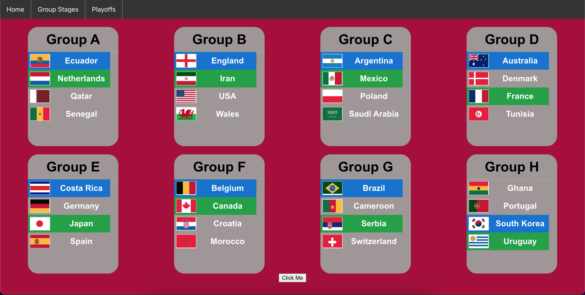

# World Cup Bracket

This project is built during world cup season to help people create their own bracket with ease. 

The countries could be selected in the group stages. The blue indicates first place and green indicates second place.

Upon clicking all the countries with respective first and second place, the user can click "click me" to update the countries in the plaoff bracket.

The user can then choose the countries in the bracket to successively advance the country of the user's choice one by one.

